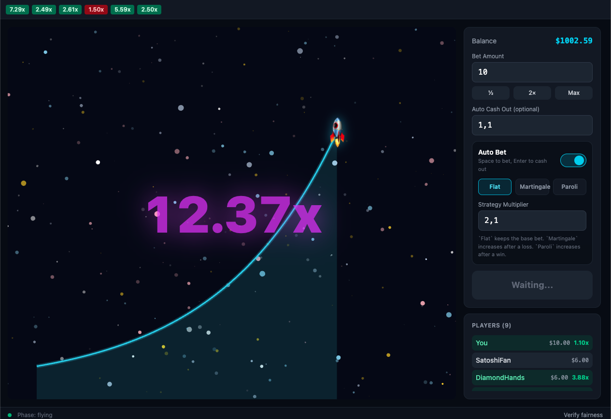

# Crash Game — Senior Game Engineer Challenge

A provably fair Crash game (Aviator-style) with a rocket/space theme. Built as a technical challenge for the Senior Game Engineer position.

**Read [`CHALLENGE.md`](./CHALLENGE.md) for full instructions.**

## Current State

The project now includes:

- restored active bets after WebSocket reconnect;
- auto-bet with `flat`, `martingale`, and `paroli` strategies;
- keyboard shortcuts: `Space` to place a bet, `Enter` to cash out;
- sound design requirements documented in [`SOUND_REQUIREMENTS.md`](./SOUND_REQUIREMENTS.md).



## Quick Start

```bash
pnpm install
pnpm dev
```

Open [http://localhost:5173](http://localhost:5173) — server runs on port 3001 automatically.

## Tech Stack

- **Canvas**: PixiJS 8 + @pixi/react
- **Animation**: Rive
- **UI**: React 19 + Tailwind CSS 4
- **State**: Zustand 5
- **Server**: Fastify 5 + WebSocket
- **Build**: Vite + TypeScript (strict) + pnpm workspaces

## Scripts

| Command | Description |
|---------|-------------|
| `pnpm dev` | Start server + client |
| `pnpm test` | Run all tests |
| `pnpm build` | Build all packages |

## Project Structure

```
apps/client/       → React + PixiJS + Rive frontend
packages/server/   → Fastify game server (WS + REST)
packages/shared/   → Shared types + Zod schemas
```
